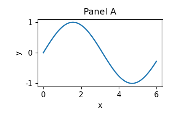
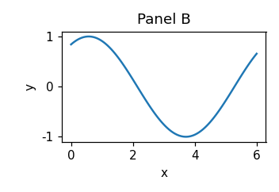
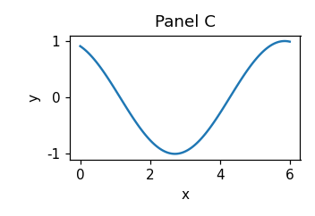

# Introduction

This document exists so that `docxaudit` has something public to run against.
It is converted with pandoc, which is enough to reproduce several of the
failures the tool looks for.

# Method

We considered a set of $n$ observations and estimated $\theta$ by minimising
the loss $\mathcal{L}(\theta) = \sum_i (y_i - f(x_i))^2$ over the training
split.

The estimator satisfies

$$\hat{\theta} = \arg\min_{\theta} \mathcal{L}(\theta).$$

# Results

| Method | Accuracy | Runtime (s) |
|--------|----------|-------------|
| Baseline | 0.71 | 12.4 |
| Ours | 0.83 | 13.1 |

Table 1 reports accuracy on the held-out split.

# Discussion

Nothing here is a real finding.
